# MetroFlow — Database Schema & ER Diagram

**Document 08** · Phase 1 Architecture · **CANONICAL NAMING CONTRACT**
**Status:** Design artifact for approval — **no tables created, no migrations run.**
**DB:** Supabase PostgreSQL. This document is the single source of truth for table & column names used across the API (11), Backend (09), RLS (19), and Postman collection.

> Convention: `snake_case`, plural table names, `id uuid default gen_random_uuid()` PKs on app tables, dataset tables keep their natural string PKs. Timestamps `timestamptz` UTC. Schema `public` unless noted.

---

## 1. ER Diagram (visual)

```mermaid
erDiagram
    metro_stations ||--o{ passenger_flow : has
    metro_stations ||--o{ ticket_transactions : at
    metro_stations ||--o{ train_operations : stops_at
    metro_stations ||--o{ train_occupancy : measured_at
    metro_stations ||--o{ metro_ai_training_data : features_for
    metro_stations ||--o{ alerts : raised_for
    metro_stations ||--o{ prediction_history : predicted_for
    external_factors }o--|| cities : for
    train_schedule ||--o{ schedule_recommendations : basis_for
    model_metadata ||--o{ prediction_history : produced_by
    auth_users ||--|| profiles : extends
    profiles ||--o{ alerts : acknowledges
    profiles ||--o{ schedule_recommendations : decides
    profiles ||--o{ audit_log : actor
    profiles ||--o{ notifications : receives

    metro_stations {
        string station_id PK
        string metro_name
        string state
        string city
        string station_name
        string station_code
        string line_name
        float latitude
        float longitude
        int opening_year
        bool interchange_station
        int platform_count
        int daily_average_footfall
        string station_category
    }
    passenger_flow {
        string record_id PK
        date date
        time time
        string station_id FK
        int entry_count
        int exit_count
        int total_passengers
        bool peak_hour_flag
        string weekday
        bool holiday_flag
        string weather_condition
        string event_near_station
        string crowd_density_level
    }
    ticket_transactions {
        string transaction_id PK
        string station_id FK
        timestamp timestamp
        string ticket_type
        string passenger_category
        string entry_station
        string exit_station
        int travel_duration
        int fare_amount
        string payment_method
    }
    train_operations {
        string train_id
        string metro_name
        string line_name
        string station_id FK
        time arrival_time
        time departure_time
        time scheduled_time
        time actual_time
        int delay_minutes
        int train_frequency
        int occupancy_percentage
        string service_status
    }
    train_occupancy {
        string train_id
        date date
        time time
        string station_id FK
        int coach_capacity
        int current_passengers
        float occupancy_percentage
        string crowd_level
    }
    external_factors {
        date date
        string city
        string weather
        float temperature
        float rainfall
        bool public_holiday
        string festival
        string major_event
        float impact_percentage
    }
    train_schedule {
        string schedule_id PK
        string metro_name
        string line_name
        string time_slot
        int current_frequency
        int recommended_frequency
        float passenger_demand
        float delay_probability
        float optimization_score
    }
    profiles {
        uuid id PK
        string full_name
        string role
        string avatar_url
        string assigned_network
        bool is_active
        timestamp last_active_at
        timestamp created_at
    }
    alerts {
        uuid id PK
        string type
        string severity
        string station_id FK
        string line_name
        string message
        string status
        uuid acknowledged_by FK
        timestamp acknowledged_at
        timestamp created_at
    }
    prediction_history {
        uuid id PK
        string station_id FK
        timestamp target_hour
        string crowd_level
        int passenger_count
        float congestion_probability
        int recommended_frequency
        float confidence
        uuid model_id FK
        timestamp created_at
    }
    schedule_recommendations {
        uuid id PK
        string schedule_id FK
        string line_name
        string time_slot
        int current_frequency
        int recommended_frequency
        float optimization_score
        string status
        uuid decided_by FK
        timestamp decided_at
        timestamp created_at
    }
    model_metadata {
        uuid id PK
        string name
        string task
        string version
        string algorithm
        jsonb metrics
        string artifact_path
        bool is_active
        timestamp trained_at
    }
    audit_log {
        uuid id PK
        uuid actor FK
        string action
        string entity
        string entity_id
        jsonb payload
        timestamp created_at
    }
    notifications {
        uuid id PK
        uuid user_id FK
        string title
        string body
        string level
        bool is_read
        timestamp created_at
    }
```



---

## 2. Table Groups

### 2.1 Dataset (reference/fact) tables — loaded from the 8 CSVs
`metro_stations` (master, 725) · `passenger_flow` (224,010) · `ticket_transactions` (65,000) · `train_operations` (44,333) · `train_occupancy` (10,902) · `external_factors` (2,070) · `train_schedule` (490).

**Hot vs offline:** all seven above are loaded **hot** into Supabase for the app. `metro_ai_training_data` (224,010) is used for **offline training only** and kept in object storage / a separate `staging` schema, not queried by the live app (per Doc 5 decision).

### 2.2 Application tables (new)
`profiles` · `alerts` · `prediction_history` · `schedule_recommendations` · `model_metadata` · `audit_log` · `notifications`.

### 2.3 Derived / performance objects
- `mv_station_daily` — materialized view: per station × day totals (footfall, avg occupancy, peak flag). Refreshed nightly / on replay checkpoint.
- `mv_line_hourly_congestion` — per line × hour congestion % (feeds heatmap).
- `mv_analytics_summary` — KPI rollups (mirrors precomputed `analytics_report.json`).

---

## 3. DDL Reference (illustrative — NOT executed)

> Shown so the API/RLS docs have exact columns. Actual migrations authored post-approval (Supabase migration files, Doc 12).

```sql
-- ===== app enums =====
create type user_role       as enum ('admin','operator');
create type alert_type      as enum ('overcrowding','delay','emergency');
create type alert_severity  as enum ('low','medium','high','critical','emergency');
create type alert_status    as enum ('open','acknowledged','resolved');
create type crowd_level     as enum ('Low','Medium','High','Critical');
create type reco_status     as enum ('proposed','applied','dismissed');

-- ===== profiles (extends auth.users) =====
create table public.profiles (
  id               uuid primary key references auth.users(id) on delete cascade,
  full_name        text,
  role             user_role not null default 'operator',
  avatar_url       text,
  assigned_network text,                    -- e.g. 'Delhi Metro'; null = all (admin)
  is_active        boolean not null default true,
  last_active_at   timestamptz,
  created_at       timestamptz not null default now()
);

-- ===== alerts =====
create table public.alerts (
  id               uuid primary key default gen_random_uuid(),
  type             alert_type not null,
  severity         alert_severity not null,
  station_id       text references public.metro_stations(station_id),
  line_name        text,
  message          text not null,
  status           alert_status not null default 'open',
  acknowledged_by  uuid references public.profiles(id),
  acknowledged_at  timestamptz,
  created_at       timestamptz not null default now()
);

-- ===== prediction_history =====
create table public.prediction_history (
  id                      uuid primary key default gen_random_uuid(),
  station_id              text references public.metro_stations(station_id),
  target_hour             timestamptz not null,
  crowd_level             crowd_level,
  passenger_count         integer,
  congestion_probability  real,
  recommended_frequency   integer,
  confidence              real,
  model_id                uuid references public.model_metadata(id),
  created_at              timestamptz not null default now()
);

-- ===== schedule_recommendations =====
create table public.schedule_recommendations (
  id                    uuid primary key default gen_random_uuid(),
  schedule_id           text references public.train_schedule(schedule_id),
  line_name             text,
  time_slot             text,
  current_frequency     integer,
  recommended_frequency integer,
  optimization_score    real,
  status                reco_status not null default 'proposed',
  decided_by            uuid references public.profiles(id),
  decided_at            timestamptz,
  created_at            timestamptz not null default now()
);

-- ===== model_metadata =====
create table public.model_metadata (
  id            uuid primary key default gen_random_uuid(),
  name          text not null,             -- 'crowd_classifier'
  task          text not null,             -- 'crowd'|'demand'|'congestion'|'frequency'
  version       text not null,             -- 'v1.0.0'
  algorithm     text not null,             -- 'xgboost'|'random_forest'|'lstm'
  metrics       jsonb,                     -- {macro_f1:.., mae:..}
  artifact_path text,                      -- storage path to model+encoders
  is_active     boolean not null default false,
  trained_at    timestamptz not null default now()
);

-- ===== audit_log =====
create table public.audit_log (
  id         uuid primary key default gen_random_uuid(),
  actor      uuid references public.profiles(id),
  action     text not null,               -- 'alert.ack','reco.apply','user.role_change'
  entity     text not null,
  entity_id  text,
  payload    jsonb,
  created_at timestamptz not null default now()
);

-- ===== notifications =====
create table public.notifications (
  id         uuid primary key default gen_random_uuid(),
  user_id    uuid references public.profiles(id) on delete cascade,
  title      text not null,
  body       text,
  level      text not null default 'info', -- info|warning|critical
  is_read    boolean not null default false,
  created_at timestamptz not null default now()
);
```

Dataset tables are created to mirror the CSV columns in Doc 3 §3 (types per the data dictionary). `crowd_density_level` / `crowd_level` columns use the `crowd_level` enum.

---

## 4. Indexes

| Table | Index | Purpose |
|---|---|---|
| passenger_flow | `(station_id, date, time)` composite | time-series & heatmap queries |
| passenger_flow | `(date)`, `(crowd_density_level)` | daily rollups, filtering |
| ticket_transactions | `(station_id)`, `(timestamp)`, `(entry_station, exit_station)` | O-D & revenue |
| train_operations | `(line_name, station_id)`, `(service_status)` | delay/ops views |
| train_occupancy | `(station_id, date, time)` | occupancy series |
| alerts | partial `(status) where status='open'`, `(station_id)`, `(created_at desc)` | alert rail |
| prediction_history | `(station_id, target_hour)`, `(model_id)` | prediction lookups |
| schedule_recommendations | `(line_name, time_slot)`, `(status)` | scheduling views |
| audit_log | `(actor)`, `(created_at desc)`, `(entity, entity_id)` | audit trace |
| notifications | `(user_id, is_read)` | inbox |

All FKs get btree indexes. Consider BRIN on `passenger_flow(date)` given the large, time-ordered volume.

---

## 5. Roles & Access (summary — full policy in Doc 19)

| Capability | Admin | Operator |
|---|:--:|:--:|
| View monitoring/analytics | ✅ all networks | ✅ `assigned_network` only |
| Acknowledge alerts | ✅ | ✅ (own network) |
| Create emergency broadcast | ✅ | ❌ |
| Apply schedule recommendation | ✅ | ❌ (propose only) |
| Manage users / roles | ✅ | ❌ |
| Replay control / settings | ✅ | ❌ |
| Read own profile | ✅ | ✅ |

Enforced by **Supabase RLS** (Doc 19) + FastAPI dependency guards. Every write records an `audit_log` row.

---

## 6. Data Loading Plan (post-approval)
1. Create schema + enums + tables (migrations).
2. Bulk-load the 7 hot CSVs via `COPY` / Supabase import; validate row counts against `dataset_summary.json`.
3. Create indexes + materialized views; run initial refresh.
4. Seed `model_metadata` after first training; `profiles` created on signup (trigger from `auth.users`).
5. Enable RLS + policies (Doc 19) before exposing the API.

## 7. Notes
- `event_near_station`, `festival`, `major_event` store the literal `'None'` (categorical, not null) — preserved as-is.
- Replay engine writes "current" state to Redis and appends to `passenger_flow`/`train_occupancy` (or a `live_state` view) as the simulated clock advances.
- `mv_*` materialized views keep the dashboard fast; refresh cadence tuned in Doc 20.
