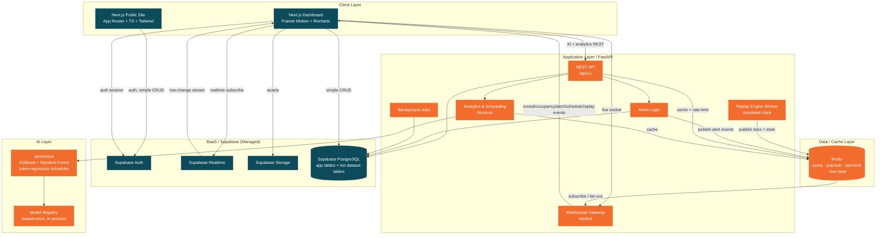
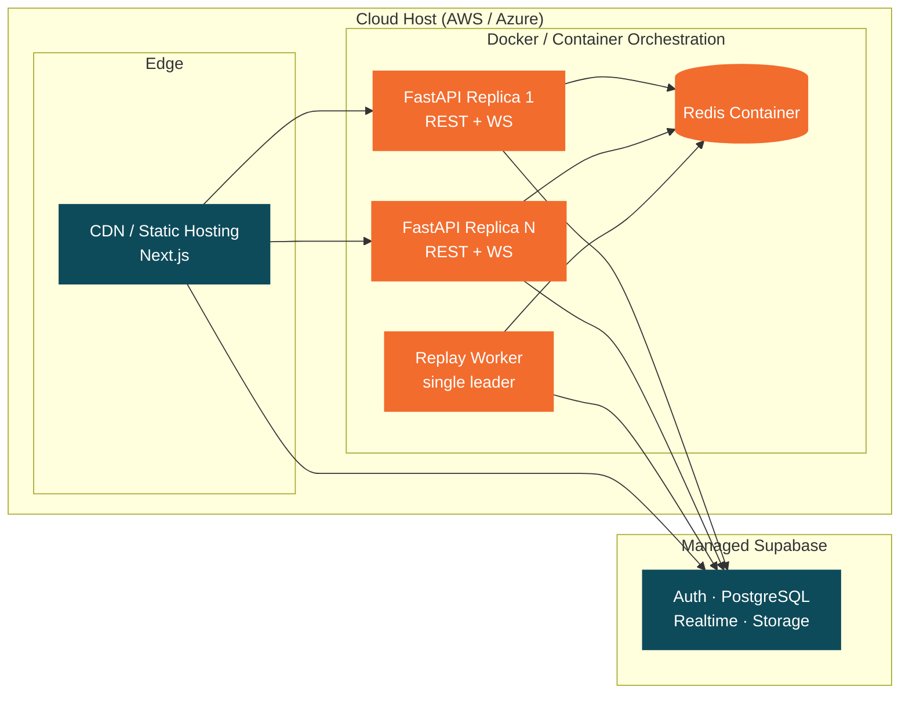

# MetroFlow — System Architecture Diagram

**Document 13**
**Status:** Design artifact — not implemented.

---

## 1. Purpose & Scope

This document is the authoritative container/component view of the MetroFlow platform — an AI-powered metro crowd management and scheduling system. It shows how the frontend, Supabase (BaaS), the FastAPI application tier, the AI/ML services, and the Redis data/cache layer compose into a single system, and how data moves between them.

It complements — and should be read alongside — the following sibling documents:

- `05_Application_Architecture.md` — end-to-end application composition and module boundaries.
- `08_Database_Schema.md` — table definitions, relationships, and the 8-CSV dataset model.
- `09_Backend_Architecture.md` — FastAPI service internals, workers, and job orchestration.
- `10_AI_ML_Architecture.md` — model design, training pipeline, and serving.
- `11_API_Documentation.md` — REST (`/api/v1`) and WebSocket (`/ws/live`) contracts.
- `16_Docker_Deployment_Architecture.md` — full container topology, images, and orchestration.

This document does not restate the product requirements. It assumes the confirmed platform decisions summarized below.

---

## 2. Confirmed Architectural Decisions

| # | Decision |
|---|----------|
| a | **Unified palette:** deep petrol-teal `#0E4B5A` + signal-orange `#F26C2E`. |
| b | **"Real-time" is a replay engine:** a worker streams the historical dataset on a simulated clock; there is no live sensor feed. |
| c | **Hybrid backend:** Supabase owns Auth, PostgreSQL, Realtime, and Storage. FastAPI owns AI/ML, heavy analytics, alerts logic, scheduling recommendations, WebSocket streaming, the replay engine, and background jobs. |
| d | **AI approach:** XGBoost + Random Forest as primary models (LSTM/Prophet optional); an interpretable rules + regression scheduler. |

**Dataset context:** 571,540 rows across 8 relational CSVs (`metro_stations`, `passenger_flow`, `ticket_transactions`, `train_operations`, `train_occupancy`, `external_factors`, `train_schedule`, `metro_ai_training_data`) — 725 stations, 17 Indian metros, a 90-day window (Oct–Dec 2024). See `08_Database_Schema.md`.

**Application DB tables:** `profiles`, `alerts`, `prediction_history`, `schedule_recommendations`, `model_metadata`, `audit_log`, `notifications`, plus the 7 hot dataset tables. `metro_ai_training_data` is offline-training only and is not served at runtime.

---

## 3. High-Level Container & Component Diagram

The system is organized into six layers: **Client**, **BaaS / Supabase**, **Application / FastAPI**, **AI**, **Data / Cache**, and **Infrastructure**.

**Reading the diagram**

- The **Client** talks to **Supabase directly** for authentication, realtime row subscriptions, simple CRUD, and asset storage — and to **FastAPI** for anything requiring AI, heavy analytics, or streamed live events.
- **FastAPI** is the only tier that loads models, runs the replay engine, and computes alerts/schedules. It reads and writes the same **Supabase PostgreSQL** instance that the client reads for CRUD.
- **Redis** is the fan-out backbone: the single replay worker and the alerts logic publish events; every WebSocket-serving replica subscribes and pushes to its connected clients.

---

## 4. Data-Flow Narratives

### Flow 1 — Live Crowd Monitoring via Replay

1. The dashboard opens a socket to `/ws/live` and subscribes to `crowd.update` / `occupancy.update` / `replay.tick`.
2. The **single leader replay worker** advances its simulated clock and reads the next slice of the historical dataset.
3. The worker writes derived live-state into Redis and **publishes** `replay.tick`, `crowd.update`, and `occupancy.update` to Redis pub/sub.
4. Every FastAPI replica hosting sockets is subscribed; each fans the events out to its connected clients.
5. The dashboard updates Recharts visuals and animated indicators in place — no page reload.

### Flow 2 — AI Prediction Request

1. The dashboard calls a REST endpoint under `/api/v1` (e.g. crowd/occupancy forecast) with station/time parameters.
2. FastAPI checks **Redis cache** for a matching recent result; on a hit it returns immediately.
3. On a miss, the **Analytics service** invokes the in-process model from the **loaded-once registry** (XGBoost / Random Forest).
4. The prediction is written to `prediction_history` in Postgres and cached in Redis with a short TTL.
5. The response returns to the client for display; scheduling requests follow the same path through the interpretable rules + regression scheduler, persisting to `schedule_recommendations`.

### Flow 3 — Alert Lifecycle

1. During replay/analytics, the **Alerts logic** detects a threshold breach (e.g. crowd or occupancy exceeding a limit).
2. FastAPI persists a new row in `alerts` (and a corresponding `notifications` row) in Postgres, and writes an `audit_log` entry.
3. FastAPI **publishes** `alert.new` to Redis; all socket replicas fan it out to subscribed dashboards. Supabase Realtime independently streams the `alerts` row-change to any client subscribed via Supabase.
4. An operator acknowledges the alert; the client calls `/api/v1`, FastAPI updates the row and emits `alert.ack`.
5. The acknowledgement propagates to all clients (Redis fan-out + Supabase Realtime), and the state change is recorded in `audit_log`.

---

## 5. Deployment View

The logical layers map to Docker containers, managed Supabase, and a cloud host (AWS or Azure). This is a summary; the authoritative topology, images, and orchestration live in `16_Docker_Deployment_Architecture.md`.

Notes:

- The Next.js frontend deploys as static/edge-hosted assets behind a CDN.
- FastAPI runs as **horizontally scalable stateless replicas**; the **replay worker runs as exactly one leader** container.
- Redis runs as a container (or managed equivalent). Supabase is fully managed — not containerized by us.
- See `16_Docker_Deployment_Architecture.md` for image definitions, networking, secrets, and scaling policy.

---

## 6. Technology Mapping

| Layer | Technology |
|-------|-----------|
| Client | Next.js (App Router), TypeScript, Tailwind CSS, Framer Motion, Recharts |
| BaaS / Supabase | Supabase Auth, Supabase PostgreSQL, Supabase Realtime, Supabase Storage |
| Application / FastAPI | FastAPI (REST `/api/v1` + WebSocket `/ws/live`), analytics & scheduling services, alerts logic, replay engine, background jobs |
| AI | XGBoost, Random Forest (LSTM/Prophet optional), interpretable rules + regression scheduler, in-process model registry |
| Data / Cache | Redis (cache, pub/sub fan-out, rate-limiting, live-state store); Supabase PostgreSQL (system of record) |
| Infrastructure | Docker containers, CDN/edge hosting, cloud host (AWS/Azure), managed Supabase |

---

## 7. Scalability & Failure Modes

- **Stateless API replicas.** FastAPI REST/WS replicas hold no session-critical state locally; they can be added or removed freely behind a load balancer. Auth is validated against Supabase.
- **Redis fan-out decouples sockets from producers.** Because live events are published to Redis pub/sub, **any replica can serve any socket** — a client connected to replica A still receives events produced by the replay worker or by alerts logic on replica B. This is the key to horizontal WebSocket scaling.
- **Single leader replay worker.** The replay engine is deliberately a single leader to keep the simulated clock authoritative and monotonic. If it fails, live events pause but REST/analytics/CRUD stay fully available; recovery is restarting the single worker (which resumes from persisted clock/live-state in Redis). No split-brain from multiple clocks.
- **Models loaded once.** Each API replica loads models from the registry a single time at startup and serves predictions in-process, avoiding per-request load cost. Redis result caching further shields the models from repeated identical requests.
- **Graceful degradation.** If Redis is unavailable, caching and live fan-out degrade but Postgres-backed REST/CRUD continue. If FastAPI is unavailable, Supabase-direct auth, CRUD, and Realtime row streams continue for the client. If Supabase is unavailable, the platform is down for auth and persistence — it is the system of record.

---

*End of Document 13. For deployment specifics see `16_Docker_Deployment_Architecture.md`; for API contracts see `11_API_Documentation.md`.*
