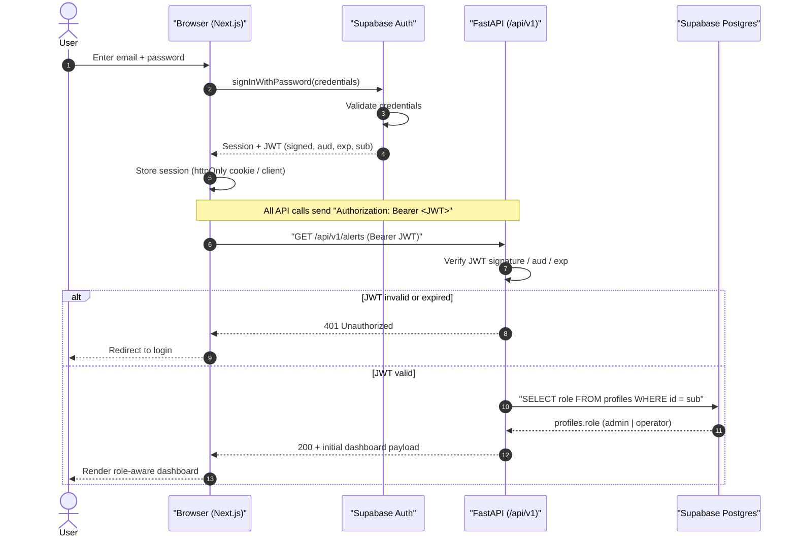
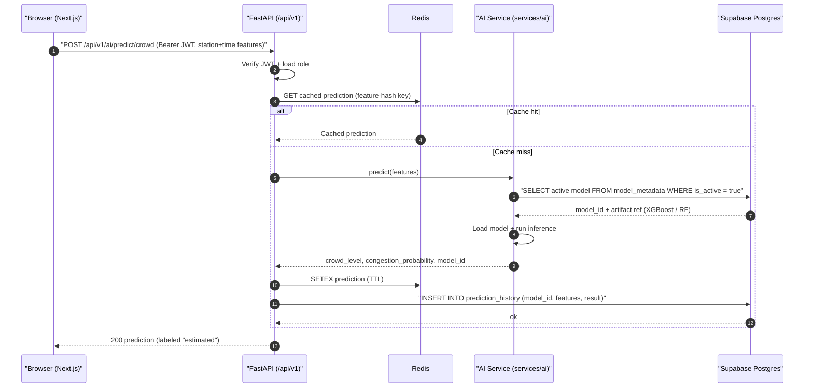
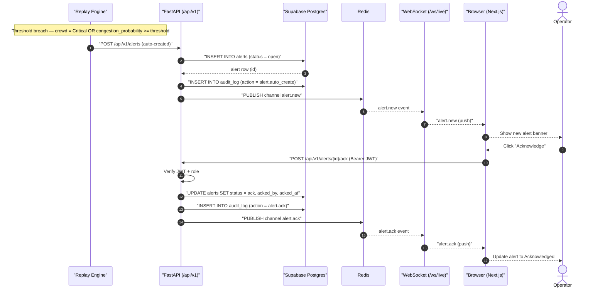
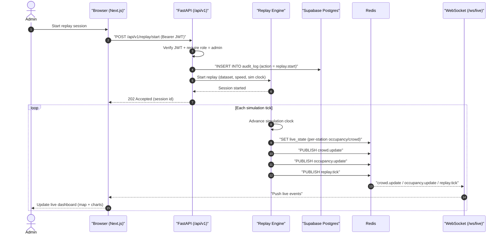

# MetroFlow — Sequence Diagrams

**Document 14**
**Status:** Design artifact — not implemented.

---

## Purpose & Scope

This document captures the key runtime interactions of the MetroFlow platform as
Mermaid sequence diagrams. It complements the contract-level detail in
[`11_API_Documentation.md`](./11_API_Documentation.md) and the component/layering
model in [`09_Backend_Architecture.md`](./09_Backend_Architecture.md).

**Participants used across diagrams**

| Participant | Role |
|---|---|
| Browser (Next.js) | Client dashboard for operators/admins |
| Supabase Auth | Issues JWTs (session + role claims); MetroFlow does not mint its own tokens |
| Supabase Postgres | Primary datastore (`profiles`, `alerts`, `prediction_history`, `schedule_recommendations`, `model_metadata`, `audit_log`, …) |
| Supabase Realtime | Managed change-stream channel |
| FastAPI (`/api/v1`) | Application API; **verifies** JWT signature/aud/exp and loads `profiles.role` |
| Redis | Cache + pub/sub bus + live simulation state |
| AI Service (`services/ai` models) | XGBoost / RandomForest inference |
| Replay Engine | Drives "real-time" by advancing a simulation clock over historical data |
| WebSocket (`/ws/live`) | Server → client push channel |

**Cross-cutting decisions (apply to every flow below)**

- The **Replay Engine** is the source of "real-time" — MetroFlow replays historical
  telemetry against a simulation clock rather than ingesting a live feed.
- Prediction models are **XGBoost / RandomForest**, selected from `model_metadata`.
- Every **mutating or admin action writes `audit_log`**.
- Every prediction persists its `model_id` into `prediction_history`.
- Alerts are **auto-created** when crowd level = `Critical` **or**
  `congestion_probability ≥ threshold`.

---

## 1. Login & Authenticated First Load

**Purpose:** Authenticate a user via Supabase, then have FastAPI verify the JWT and resolve role before the dashboard renders.



**Steps**

1. User submits credentials to the Next.js client.
2. Client calls Supabase Auth `signInWithPassword`.
3. Supabase validates and returns a signed JWT (with `aud`, `exp`, `sub`).
4. Client stores the session and attaches `Authorization: Bearer <JWT>` to API calls.
5. FastAPI **verifies** the token (signature/aud/exp) — it never issues tokens.
6. On success FastAPI loads `profiles.role` to determine `admin` vs `operator`.
7. A role-aware dashboard payload is returned and rendered; invalid tokens yield `401` and a redirect.

---

## 2. AI Crowd Prediction

**Purpose:** Run a crowd-level prediction, caching the result and persisting it (with `model_id`) to history.



**Steps**

1. Client POSTs feature payload to `POST /api/v1/ai/predict/crowd`.
2. FastAPI verifies the JWT and loads the caller role.
3. FastAPI checks Redis for a cached result keyed by the feature hash.
4. On a miss, the AI Service selects the active model from `model_metadata` (XGBoost/RF).
5. The model runs inference and returns `crowd_level`, `congestion_probability`, and `model_id`.
6. FastAPI caches the result in Redis and writes a `prediction_history` row including `model_id`.
7. The response is returned to the client labeled **estimated** (model output, not ground truth).

---

## 3. Alert Lifecycle

**Purpose:** Auto-create an alert on threshold breach, broadcast it live, then let an operator acknowledge it with an audit trail.



**Steps**

1. The Replay Engine detects a breach (crowd `Critical` **or** `congestion_probability ≥ threshold`).
2. It calls `POST /api/v1/alerts`; FastAPI inserts an `open` row in `alerts`.
3. FastAPI writes an `audit_log` entry for the auto-creation.
4. FastAPI publishes `alert.new` on Redis pub/sub; the WebSocket relays it to connected clients.
5. An operator clicks Acknowledge, triggering `POST /api/v1/alerts/{id}/ack`.
6. FastAPI updates the alert to `ack` and writes an `audit_log` entry.
7. FastAPI publishes `alert.ack`, broadcast over the WebSocket so all dashboards reflect the state.

---

## 4. Scheduling Recommendation & Apply

**Purpose:** Generate a schedule recommendation, then have an admin apply it with role enforcement and audit.

```mermaid
sequenceDiagram
    autonumber
    actor A as Admin
    participant B as "Browser (Next.js)"
    participant API as "FastAPI (/api/v1)"
    participant AI as "AI Service (services/ai)"
    participant PG as "Supabase Postgres"
    participant R as Redis
    participant WS as "WebSocket (/ws/live)"

    B->>API: "GET /api/v1/ai/schedule/recommend (Bearer JWT)"
    API->>API: Verify JWT + load role
    API->>AI: Compute recommendation (demand + headway)
    AI-->>API: Proposed schedule adjustments
    API->>PG: "INSERT INTO schedule_recommendations (status = proposed)"
    PG-->>API: recommendation id
    API-->>B: 200 recommendation (proposed)

    Note over B,API: Operators may only PROPOSE; only admins may APPLY (enforced by RLS + role check)

    A->>B: Review + click "Apply"
    B->>API: "POST /api/v1/schedules/recommendations/{id}/apply (Bearer JWT)"
    API->>API: Verify JWT + require role = admin
    alt role != admin
        API-->>B: 403 Forbidden
    else role = admin
        API->>PG: "UPDATE schedule_recommendations SET status = applied, applied_by"
        API->>PG: "INSERT INTO audit_log (action = schedule.apply)"
        API->>R: "PUBLISH channel schedule.recommendation"
        R-->>WS: schedule.recommendation event
        WS-->>B: "schedule.recommendation (push)"
        B-->>A: Show applied schedule
    end
```

**Steps**

1. Client requests `GET /api/v1/ai/schedule/recommend`; FastAPI verifies the JWT and role.
2. The AI Service computes proposed schedule adjustments from demand/headway inputs.
3. FastAPI persists a `schedule_recommendations` row with status `proposed` and returns it.
4. Role rule: operators can only **propose**; only **admins** can **apply** — enforced by Postgres RLS and the API role check.
5. An admin applies via `POST /api/v1/schedules/recommendations/{id}/apply`; non-admins get `403`.
6. FastAPI updates the recommendation to `applied` and writes an `audit_log` entry.
7. FastAPI publishes `schedule.recommendation`, broadcast over the WebSocket to update dashboards.

---

## 5. Replay-Driven Live Monitoring

**Purpose:** Start a replay session so the simulation clock streams synthetic "live" telemetry to dashboards.



**Steps**

1. An admin starts a session via `POST /api/v1/replay/start`; FastAPI verifies the JWT and requires `admin`.
2. FastAPI writes a `replay.start` entry to `audit_log` and instructs the Replay Engine to begin (dataset, speed, sim clock).
3. The API returns `202 Accepted` with a session id.
4. On each tick the Replay Engine advances the simulation clock.
5. It writes the current `live_state` (per-station occupancy/crowd) to Redis.
6. It publishes `crowd.update`, `occupancy.update`, and `replay.tick` on the Redis bus.
7. The WebSocket relays these events to subscribed clients, which update the live dashboard.

---

## References

- [`11_API_Documentation.md`](./11_API_Documentation.md) — endpoint contracts, request/response schemas, and WS event payloads.
- [`09_Backend_Architecture.md`](./09_Backend_Architecture.md) — component layering, auth verification model, Redis/pub-sub topology, and Replay Engine design.
