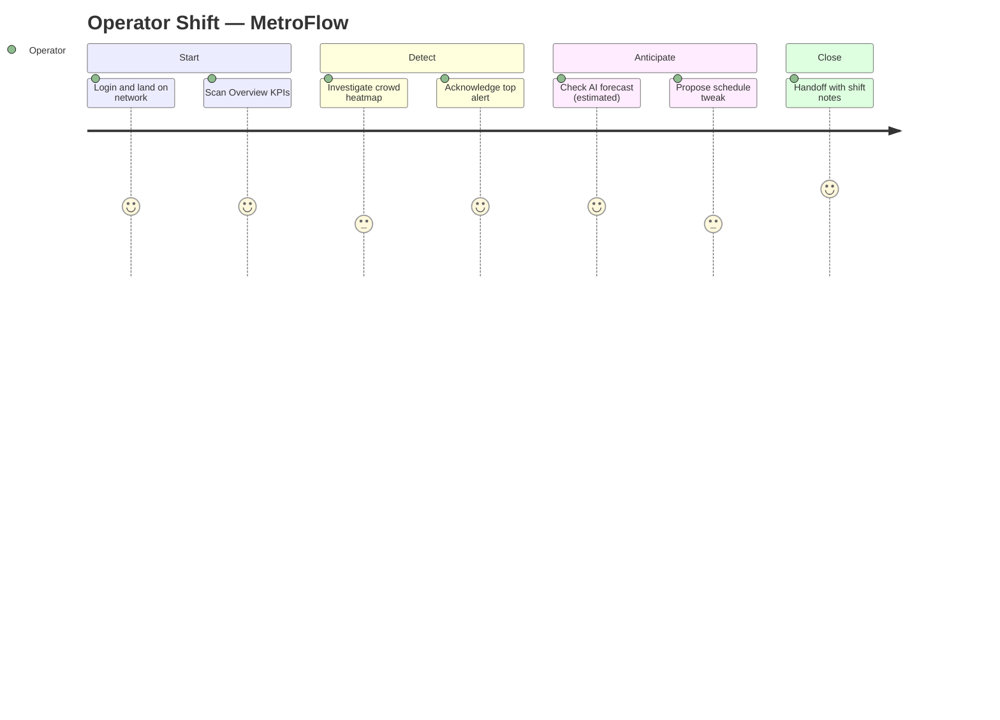

# MetroFlow — User Journey Maps

**Document 15**
**Status:** Design artifact.

---

## 1. Purpose & Scope

This document maps the end-to-end experience of MetroFlow's three primary personas across the product surface — from public-website evaluation through authenticated AI-dashboard operations. Each map identifies user goals, actions, touchpoints (by screen code), emotional state, and design opportunities. It is the connective tissue between market positioning and the UI screen contracts defined in **06_UI_Screen_Specifications.md**.

MetroFlow is a **data-only, privacy-preserving** platform: there is no CCTV or biometric surveillance. All crowd intelligence is derived from anonymized sensor/telemetry feeds and presented in an enterprise command-center tone (petrol-teal + orange palette).

### Screen code legend

| Code | Screen | Surface |
|------|--------|---------|
| W1 | Home | Public Website |
| W2 | Features | Public Website |
| W3 | AI | Public Website |
| W4 | Contact | Public Website |
| A1 | Login | Auth (Supabase) |
| A2 | Signup | Auth (Supabase) |
| D1 | Overview | AI Dashboard |
| D2 | Crowd Monitoring | AI Dashboard |
| D3 | Scheduling | AI Dashboard |
| D4 | AI Prediction | AI Dashboard |
| D5 | Alerts | AI Dashboard |
| D6 | Analytics | AI Dashboard |
| D7 | Users (admin) | AI Dashboard |
| D8 | Settings | AI Dashboard |

### Personas at a glance

| Persona | Role | Scope of access | Can do | Cannot do |
|---------|------|-----------------|--------|-----------|
| Website Visitor | Prospect / evaluator | Public site only | Evaluate, request access, enter auth | Access any dashboard data |
| Operator | Station operator | `assigned_network` only | Monitor, acknowledge alerts, **propose** schedule changes | Apply schedules, broadcast emergencies, manage users |
| Admin | Metro authority / transportation manager | All networks (full access) | Apply schedules, broadcast emergencies, manage users/models, control replay | — |

---

## 2. Persona 1 — Website Visitor

### Persona card

| Attribute | Detail |
|-----------|--------|
| **Role** | Prospective buyer or influencer — transit-authority decision maker, procurement lead, or operations director evaluating a crowd-management platform. |
| **Goals** | Understand what MetroFlow does, judge whether the AI is credible and safe, gauge fit for their network, and find a low-friction path to a trial or conversation. |
| **Pain points** | Skeptical of "AI" claims; wary of surveillance/privacy risk; short on time; needs proof, not marketing fluff; must justify the tool to stakeholders. |
| **Tech comfort** | Moderate to high — comfortable with SaaS dashboards, but evaluating on business value, not internals. |
| **Environment** | Office desk or mobile, browsing between meetings; often sharing tabs/links with colleagues. |
| **Success signal** | Reaches A1/A2 with intent, or submits W4 contact form. |

### Journey map

| Stage | User Goal | Actions | Touchpoints | Thoughts / Emotions | Opportunities |
|-------|-----------|---------|-------------|---------------------|---------------|
| **Discover** | Find out what this is in 10 seconds | Lands from search/referral; scans hero value proposition | **W1** | "Is this for metros like mine? Curious but guarded." | Lead with outcome ("reduce platform crowding") not tech; state privacy stance above the fold. |
| **Explore features** | Map capabilities to needs | Scans module tiles: heatmap, scheduling, alerts, analytics | **W2** → **W1** | "There's real breadth here. But does it actually work?" | Show module screenshots with the petrol-teal command-center look; anchor each feature to a KPI. |
| **Understand AI** | Judge credibility of the AI | Reads AI page: prediction, confidence, optimization score, "estimated" labeling | **W3** | "They label uncertainty — that's honest. And no cameras. Reassured." | Foreground confidence/"estimated" framing and the no-CCTV, data-only promise as trust differentiators. |
| **Decide** | Determine fit & next step | Compares to alternatives; considers stakeholders; weighs risk | **W3** → **W2** | "This could work. What's the commitment to try it?" | Persistent, unambiguous CTA; short "how it works / data sources" reassurance; social proof. |
| **Request access / Enter** | Start a trial or open a conversation | Submits contact form OR proceeds to sign up / log in | **W4** / **A2** / **A1** | "Easy to take the next step. Let's go." | One-click hop from any marketing page to A1/A2; contact form confirms response SLA. |

---

## 3. Persona 2 — Operator (Station Operator)

### Persona card

| Attribute | Detail |
|-----------|--------|
| **Role** | Station operator responsible for real-time monitoring and first response on a single **`assigned_network`**. |
| **Goals** | Keep their network safe and flowing during a shift; catch congestion early; respond to alerts fast; escalate or propose fixes without overstepping authority. |
| **Pain points** | Alert fatigue; ambiguous data; pressure to act quickly during surges; cannot apply schedule changes themselves, so needs a fast, credible path to propose them; must not be distracted by networks that aren't theirs. |
| **Tech comfort** | High for operational tooling; wants dense, glanceable information, not tutorials. |
| **Environment** | Station control room / operations desk, multi-monitor, high-tempo, often noisy; may be monitoring alongside other duties. |
| **Success signal** | Congestion addressed and alerts acknowledged before they escalate; clean handoff. |

### Journey map (one shift)

| Stage | User Goal | Actions | Touchpoints | Thoughts / Emotions | Opportunities |
|-------|-----------|---------|-------------|---------------------|---------------|
| **Login** | Get on shift quickly | Authenticates; lands scoped to `assigned_network` | **A1** → **D1** | "Straight to my network. Good." | Remember session; land on D1 pre-filtered; surface any overnight unresolved alerts immediately. |
| **Scan Overview** | Get situational picture | Reads KPIs, network status, live crowd summary, active alert count | **D1** | "Mostly green. One cluster building on the east line." | Above-the-fold health snapshot; visually rank hotspots; role-scoped so nothing off-network competes for attention. |
| **Investigate congestion** | Confirm & localize the hotspot | Opens crowd heatmap; drills to station/platform; checks trend | **D2** | "Yes — platform 3 is filling. Is it climbing or peaking?" | Heatmap with drill-down + short trend arrow; density thresholds color-matched to alert severity. |
| **Respond to alert** | Acknowledge & own the issue | Opens severity-ranked alert rail; **acknowledges** top alert | **D5** → **D2** | "Got it. Marking this mine so the team knows it's handled." | One-click acknowledge with owner + timestamp; keep operator on-context (no full page reload). |
| **Check forecast** | Anticipate the next 30–60 min | Reviews AI crowd/demand prediction with confidence for the hotspot | **D4** | "Model says it keeps rising for 40 min — estimated, but plausible." | Show confidence + "estimated" label inline; tie forecast directly to the station in question. |
| **Propose schedule tweak** | Recommend a mitigation | Opens scheduling; reviews AI recommendation + optimization score; **proposes** (not applies) a change for admin approval | **D3** → **D4** | "I'd add a service here. I can't apply it — but I can put it forward with the score attached." | Clear propose vs. apply affordance; attach forecast + optimization_score to the proposal; notify admin instantly. |
| **Handoff** | Close the shift cleanly | Reviews outstanding items; leaves shift notes; confirms proposal status | **D5** → **D1** | "Handoff is clean. Next operator knows exactly where things stand." | Shift-summary view: open alerts, pending proposals, acknowledged items with owners. |

### Operator shift — Mermaid journey

---

## 4. Persona 3 — Admin (Metro Authority / Transportation Manager)

### Persona card

| Attribute | Detail |
|-----------|--------|
| **Role** | Metro authority / transportation manager with **full access across all networks** — accountable for network-wide performance, safety, and staffing. |
| **Goals** | Maintain network-wide health; convert AI recommendations into applied schedule improvements; respond decisively to emergencies; govern users, roles, and models. |
| **Pain points** | Must trust AI enough to apply changes at scale; needs auditability and confidence context before committing; emergencies demand speed with zero fumbling; user/model governance must be safe and reversible. |
| **Tech comfort** | High — fluent in analytics and operations tooling; expects control, transparency, and traceability. |
| **Environment** | Central command center / operations HQ, large-format displays, multiple networks in view; the decision authority in the room. |
| **Success signal** | Recommendations applied with measurable impact; emergencies broadcast within seconds; governance stays clean and audited. |

### Journey map

| Stage | User Goal | Actions | Touchpoints | Thoughts / Emotions | Opportunities |
|-------|-----------|---------|-------------|---------------------|---------------|
| **Login** | Enter with full command view | Authenticates; lands on network-wide overview | **A1** → **D1** | "All networks in one view. I'm in control." | Multi-network landing; surface highest-severity items across all networks first. |
| **Network health** | Assess system-wide state & trends | Reviews cross-network KPIs; opens analytics for trends and outliers | **D1** → **D6** | "East corridor is trending worse this week. Worth digging in." | Cross-network rollups + drill-down; flag operator proposals awaiting decision. |
| **Review AI recommendations** | Judge whether to act | Opens prediction + scheduling; reads forecast confidence and optimization_score; weighs operator proposals | **D4** → **D3** | "Optimization score is strong and the forecast is confident. This is defensible." | Present confidence + optimization_score together with "estimated" labeling; show the proposal's originating operator and rationale. |
| **Apply schedule change** | Commit the improvement | Reviews impact; **applies** the recommendation (only admin can) | **D3** | "Applying. This is on record and reversible if needed." | Explicit apply action with confirmation, audit trail, and rollback; broadcast resulting change to affected operators. |
| **Handle emergency** | Respond decisively & fast | Detects critical alert; **broadcasts emergency** network-wide; may invoke replay to review | **D5** → **D1** | "Critical. Broadcast now — no hesitation, no menu-hunting." | Always-reachable emergency path (few clicks, confirm-to-send); replay/control for post-incident review. |
| **Manage users & models** | Govern access & AI | Adds/edits operators and `assigned_network`; reviews/updates model settings | **D7** → **D8** | "Roles are correct and scoped. Models are current. Governed." | Role-scoped user management with clear network assignment; model/config settings with change history. |

---

## 5. Cross-Persona Insights & Design Implications

1. **Role-scoped views are non-negotiable.** Operators must see only their `assigned_network`; admins see everything. Scoping is both a permission boundary and a focus/attention aid — off-scope data must never compete for an operator's attention. *(See 06 — access-control and view-scoping contracts.)*

2. **Propose vs. apply must be unmistakable.** Operators propose; admins apply. The UI has to make the operator's ceiling obvious (no dead-end "apply" buttons) while giving the admin a decisive, audited apply action with rollback.

3. **One-click acknowledge, in context.** Alert acknowledgement should be a single action that stamps owner + timestamp and keeps the responder on-context — critical under the alert-fatigue and high-tempo conditions of a control room.

4. **Confidence and "estimated" labeling everywhere the AI speaks.** Predictions carry confidence; recommendations carry optimization_score; both are always framed as *estimated*. This honesty is a trust differentiator from the marketing site (W3) through to the point of action (D3/D4) and is what earns the admin's willingness to apply.

5. **The emergency path must be the fastest path.** Broadcast is admin-only and must be reachable in seconds from anywhere in the dashboard, with confirm-to-send to prevent misfires. Speed and safety are co-requirements.

6. **Continuity of trust from site to product.** The privacy-preserving, data-only (no-CCTV) promise and the command-center aesthetic must carry unbroken from W1–W3 into D1–D8, so the credibility built during evaluation is honored in operation.

7. **Frictionless marketing-to-auth handoff.** Every public page (W1–W4) offers a one-click route to A1/A2, converting evaluation intent before it cools.

8. **Auditability underpins authority.** Applied schedules, emergency broadcasts, user changes, and model updates all need traceable history and (where possible) reversibility — the basis on which admins act at network scale.

---

## 6. Cross-References

- **06_UI_Screen_Specifications.md** — authoritative screen contracts, layouts, and interaction specs for all W/A/D codes referenced above (heatmap drill-down, severity-ranked alert rail, propose/apply affordances, emergency broadcast, replay controls, role-scoped user management).

---

*End of Document 15 — Design artifact.*
