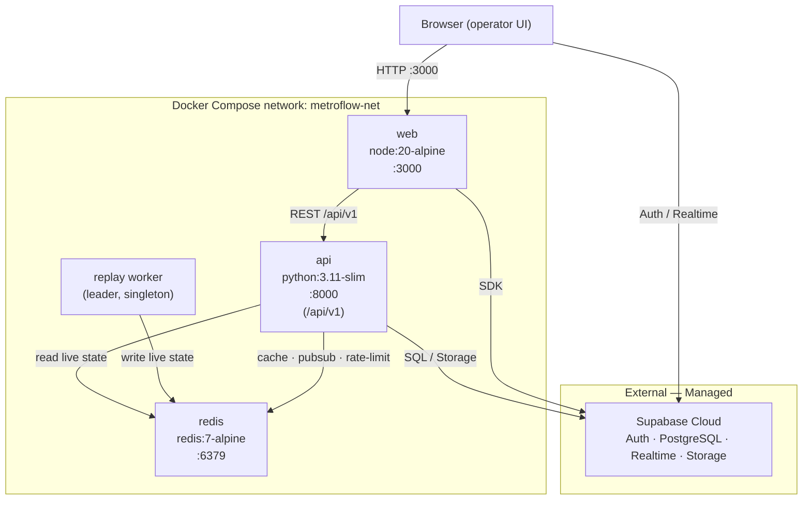

# MetroFlow — Docker & Deployment Architecture

**Document 16**
**Status:** Design artifact — nothing built.

> Planning phase only. Every Dockerfile, Compose file, and cloud mapping below is **illustrative / not yet created**. These artifacts describe the intended packaging and deployment topology; they are design references, not shipped code.

---

## 1. Overview

MetroFlow is an AI-driven metro crowd management and scheduling platform delivered from a single monorepo. This document defines how the monorepo's deployable units are containerized, wired together locally via Docker Compose, and mapped onto AWS or Azure for staging and production.

**Deployable units (from the monorepo):**

- `apps/web` — Next.js frontend.
- `apps/api` — FastAPI backend, base URL `/api/v1`.
- `services/ai` — Python ML code used by `api`. Can ship as the **same image** as `api` (imported as a library) or as a **sidecar** container. Default: same image.
- **Replay Engine** — a single **leader** worker that computes live simulation/replay state and writes it to Redis. Runs either as a **separate container** or as a **process inside the api image**.
- **Redis** — cache, pub/sub, and rate-limiting backing store.

**Managed external dependency:**

- **Supabase** is a **managed cloud project** providing Auth, PostgreSQL, Realtime, and Storage. It is **not self-hosted** in normal deployments. The containers treat it as an external endpoint.

**Deploy targets:**

- **Local:** Docker + Docker Compose.
- **Cloud:** AWS **or** Azure (container-based).
- **API testing:** Postman (mentioned for reference only).

See `12_Project_Folder_Structure.md` for the monorepo layout, `09_Backend_Architecture.md` for backend internals, and `17_Environment_Variables.md` for the authoritative environment-variable catalog.

---

## 2. Container inventory

| Service | Image base | Ports | depends_on | Scaling notes |
|---|---|---|---|---|
| **web** (`apps/web`) | `node:20-alpine` | `3000` | `api` | Stateless. Horizontally scalable; talks to Supabase directly and to FastAPI. In cloud, often replaced by static hosting/CDN or Vercel. |
| **api** (`apps/api` + `services/ai`) | `python:3.11-slim` | `8000` | `redis`, (Supabase external) | Stateless request handling → scale horizontally behind a load balancer. Model artifacts baked into image. AI runs in-process or as sidecar. |
| **replay** (Replay Engine) | `python:3.11-slim` (reuses api image) | none exposed | `redis` | **Singleton leader — exactly one instance.** Writes live state to Redis; do **not** scale beyond 1. |
| **redis** | `redis:7-alpine` | `6379` | — | Single instance locally. In cloud use managed Redis (ElastiCache / Azure Cache). Fan-out hub for pub/sub and shared state. |
| **Supabase** | — (managed cloud) | — | — | **External / managed.** Not a container. Provides Auth + PostgreSQL + Realtime + Storage. Separate project per environment. |

---

## 3. Deployment topology (dev / Compose)



---

## 4. Illustrative Dockerfiles

> **Illustrative — not yet created.** Multi-stage builds; final images are lean.

### 4.1 `apps/web` — Next.js (standalone output)

```dockerfile
# ---- deps ----
FROM node:20-alpine AS deps
WORKDIR /app
COPY package.json package-lock.json ./
RUN npm ci

# ---- build ----
FROM node:20-alpine AS build
WORKDIR /app
COPY --from=deps /app/node_modules ./node_modules
COPY . .
RUN npm run build          # next.config: output "standalone"

# ---- runtime ----
FROM node:20-alpine AS runner
WORKDIR /app
ENV NODE_ENV=production
COPY --from=build /app/.next/standalone ./
COPY --from=build /app/.next/static ./.next/static
COPY --from=build /app/public ./public
EXPOSE 3000
CMD ["node", "server.js"]
```

### 4.2 `apps/api` — FastAPI + gunicorn/uvicorn (with model artifacts)

```dockerfile
# ---- build ----
FROM python:3.11-slim AS build
WORKDIR /app
COPY apps/api/requirements.txt ./
RUN pip install --no-cache-dir --prefix=/install -r requirements.txt

# ---- runtime ----
FROM python:3.11-slim AS runtime
WORKDIR /app
COPY --from=build /install /usr/local
COPY apps/api ./apps/api
COPY services/ai ./services/ai
COPY models/ ${MODEL_DIR:-/app/models}   # bake model artifacts into image
ENV PYTHONUNBUFFERED=1
EXPOSE 8000
# gunicorn manages uvicorn workers; stateless API scales horizontally
CMD ["gunicorn", "apps.api.main:app", \
     "-k", "uvicorn.workers.UvicornWorker", \
     "-w", "4", "-b", "0.0.0.0:8000"]
```

> The **replay worker** reuses this same image with a different entrypoint (e.g. `python -m apps.api.replay.leader`), enforcing a single instance.

---

## 5. Illustrative `docker-compose.yml`

> **Illustrative — not yet created.** Env values are supplied via `.env` files per `17_Environment_Variables.md`.

```yaml
services:
  web:
    build:
      context: .
      dockerfile: apps/web/Dockerfile
    ports:
      - "3000:3000"
    env_file:
      - ./apps/web/.env
    depends_on:
      - api
    networks:
      - metroflow-net

  api:
    build:
      context: .
      dockerfile: apps/api/Dockerfile
    ports:
      - "8000:8000"
    env_file:
      - ./apps/api/.env
    depends_on:
      - redis
    networks:
      - metroflow-net

  replay:
    build:
      context: .
      dockerfile: apps/api/Dockerfile
    command: ["python", "-m", "apps.api.replay.leader"]
    env_file:
      - ./apps/api/.env
    depends_on:
      - redis
    networks:
      - metroflow-net

  redis:
    image: redis:7-alpine
    ports:
      - "6379:6379"
    networks:
      - metroflow-net

networks:
  metroflow-net:
    driver: bridge
```

> Supabase is intentionally **absent** — it is a managed cloud endpoint referenced via `NEXT_PUBLIC_SUPABASE_URL` and `DATABASE_URL`, not a Compose service.

---

## 6. Environments

Promotion path: **local (Compose) → staging → production**. Each environment points at its **own separate managed Supabase project** — projects are never shared across environments.

| Environment | Runtime | Supabase project | Redis | Notes |
|---|---|---|---|---|
| **Local** | Docker Compose | Dedicated dev project (or local branch) | Compose `redis` container | Full stack on one machine; Postman used for API smoke tests against `http://localhost:8000/api/v1`. |
| **Staging** | Cloud containers (ECS/Fargate or Azure Container Apps) | Separate staging project | Managed Redis | Mirror of production for pre-release validation; runs migrations on deploy. |
| **Production** | Cloud containers, multi-instance api | Separate production project | Managed Redis (HA) | Horizontally scaled api, single replay leader, CDN-fronted web. |

Environment-specific configuration (`NEXT_PUBLIC_SUPABASE_URL`, `SUPABASE_JWT_SECRET`, `DATABASE_URL`, `REDIS_URL`, `MODEL_DIR`, `REPLAY_DEFAULT_SPEED`, …) is defined in **`17_Environment_Variables.md`** — not re-enumerated here.

---

## 7. Cloud deployment (AWS / Azure)

Concise mapping of each unit onto both clouds. Both follow the same shape: run the containers on a managed container platform, use managed Redis, store images in a registry, front the web with a CDN, and keep secrets in a managed vault.

| Concern | AWS | Azure |
|---|---|---|
| **api / replay containers** | ECS on **Fargate** (api = service w/ ≥2 tasks; replay = 1 task, no autoscale) | **Azure Container Apps** (api scales; replay min=max=1 replica) |
| **Redis** | **ElastiCache** for Redis | **Azure Cache** for Redis |
| **Image registry** | **ECR** | **ACR** |
| **web (frontend)** | Static export + **CloudFront** CDN (or **Vercel**) | Static Web Apps + **Azure CDN** (or **Vercel**) |
| **Secrets / config** | **AWS Secrets Manager** / SSM Parameter Store | **Azure Key Vault** |
| **Load balancing** | ALB in front of api tasks | Container Apps ingress |
| **Database / Auth / Storage / Realtime** | **Supabase (managed)** — external | **Supabase (managed)** — external |

Notes:
- The **web** tier is frequently hosted on **Vercel** instead of a container, since Next.js deploys natively there; the container image remains the fallback/self-hosted option.
- The **replay leader** is pinned to a single replica on either platform — never autoscaled.
- Supabase remains managed regardless of cloud choice; only its connection URLs and JWT secret change per environment.

---

## 8. CI/CD

**GitHub Actions** pipeline (illustrative):

1. **Lint** — web (ESLint) and api (ruff/flake8).
2. **Test** — unit/integration for `apps/api`, `apps/web`, `services/ai`.
3. **Build** — multi-stage Docker images for web and api.
4. **Push** — tagged images to ECR (AWS) or ACR (Azure).
5. **Deploy** — update ECS/Fargate service or Azure Container Apps revision.
6. **Migrations** — database migrations run **on deploy**, before the new api revision goes live, against the environment's Supabase PostgreSQL (`DATABASE_URL`).

Branch → environment mapping: feature branches build/test only; `main` deploys to staging; tagged releases promote to production.

---

## 9. Health, logging, scaling

- **Health checks:** `GET /api/v1/health` is the liveness/readiness probe for the api service (used by the load balancer and container platform). The replay worker exposes an internal heartbeat written to Redis.
- **Logging:** structured JSON logs to stdout, collected by the platform (CloudWatch / Azure Monitor).
- **Horizontal scaling — api:** the api is **stateless**; all shared state (cache, pub/sub, rate-limit counters, live replay state) lives in **Redis**, so instances scale out freely and fan out via Redis.
- **Single replay leader:** exactly **one** replay worker runs at any time; it is the sole writer of live state to Redis. Scaling this to more than one instance is a correctness violation.
- **Model artifacts:** baked into the api image at build time (`MODEL_DIR`), or optionally pulled at startup from **Supabase Storage** when artifacts must be updated independently of image releases.

---

## 10. Cross-references

- **`12_Project_Folder_Structure.md`** — monorepo layout (`apps/web`, `apps/api`, `services/ai`).
- **`17_Environment_Variables.md`** — authoritative environment-variable catalog (`NEXT_PUBLIC_SUPABASE_URL`, `SUPABASE_JWT_SECRET`, `DATABASE_URL`, `REDIS_URL`, `MODEL_DIR`, `REPLAY_DEFAULT_SPEED`, …).
- **`09_Backend_Architecture.md`** — FastAPI service internals, `/api/v1` design, replay engine, and Redis usage.
